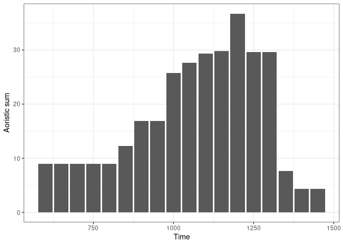
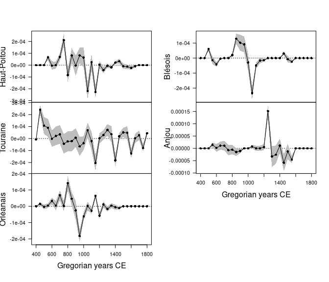

<!-- README.md is generated from README.Rmd. Please edit that file -->

# kairos 

<!-- badges: start -->

[](https://github.com/tesselle/kairos/actions)
[](https://app.codecov.io/gh/tesselle/kairos)
[](https://www.codefactor.io/repository/github/tesselle/kairos)
[](https://cran.r-project.org/package=kairos)

<a href="https://tesselle.r-universe.dev/kairos"
class="pkgdown-devel"></a>
<a href="https://cran.r-project.org/package=kairos"
class="pkgdown-release"></a> <a
href="https://cran.r-project.org/web/checks/check_results_kairos.html"
class="pkgdown-release"></a>
<a href="https://cran.r-project.org/package=kairos"
class="pkgdown-release"></a>

[](https://www.repostatus.org/#active)

[](https://doi.org/10.5281/zenodo.5653896)
<!-- badges: end -->

## Overview

A toolkit for relative and absolute dating and analysis of chronological
patterns. This package includes functions for chronological modeling and
dating of archaeological assemblages from count data. It provides
methods for matrix seriation. It also allows to compute time point
estimates and density estimates of the occupation and duration of an
archaeological site. **kairos** provides methods for:

- Matrix seriation: `seriate_rank()` and `seriate_average()`.
- Testing matrix seriation results (Porčić 2013; Peeples and Schachner
  2012): `assess()` and `refine()`.
- Mean ceramic date estimation (South 1977): `mcd()`.
- Event and accumulation date estimation (Bellanger and Husi 2012):
  `event()`.
- Aoristic analysis (Ratcliffe 2000): `aoristic()`.
- Chronological apportioning (Roberts et al. 2012): `apportion()`.

[**tabula**](https://packages.tesselle.org/tabula/) is a companion
package to **kairos** that provides functions for visualization and
analysis of archaeological count data.

------------------------------------------------------------------------

To cite kairos in publications use:

Frerebeau N (2024). *kairos: Analysis of Chronological Patterns from
Archaeological Count Data*. Université Bordeaux Montaigne, Pessac,
France. <doi:10.5281/zenodo.5653896>
<https://doi.org/10.5281/zenodo.5653896>, R package version 2.2.0,
<https://packages.tesselle.org/kairos/>.

This package is a part of the tesselle project
<https://www.tesselle.org>.

## Installation

You can install the released version of **kairos** from
[CRAN](https://CRAN.R-project.org) with:

``` r
install.packages("kairos")
```

And the development version from [GitHub](https://github.com/) with:

``` r
# install.packages("remotes")
remotes::install_github("tesselle/kairos")
```

## Usage

``` r
## Load packages
library(kairos)
#> Loading required package: dimensio
```

**kairos** uses [**aion**](https://packages.tesselle.org/aion/) for
internal date representation. Look at
`vignette("aion", package = "aion")` before you start.

*It assumes that you keep your data tidy*: each variable (type/taxa)
must be saved in its own column and each observation (sample/case) must
be saved in its own row.

``` r
## Data from Husi 2022
data("loire", package = "folio")
keep <- c("Anjou", "Blésois", "Orléanais", "Haut-Poitou", "Touraine")
loire <- subset(loire, area %in% keep)

## Get time range
loire_range <- loire[, c("lower", "upper")]

## Calculate aoristic sum (weights) by group
ao <- aoristic(loire_range, step = 50, weight = TRUE, groups = loire$area)

## Plot
plot(ao, col = "grey")
```

<!-- -->

``` r

## Rate of change by group
set.seed(12345) # Set seed for reproductibility
ro <- roc(ao, n = 30)
plot(ro)
```

<!-- -->

## Translation

This package provides translations of user-facing communications, like
messages, warnings and errors, and graphical elements (axis labels). The
preferred language is by default taken from the locale. This can be
overridden by setting of the environment variable `LANGUAGE` (you only
need to do this once per session):

``` r
Sys.setenv(LANGUAGE = "<language code>")
```

Languages currently available are English (`en`) and French (`fr`).

## Contributing

Please note that the **kairos** project is released with a [Contributor
Code of Conduct](https://www.tesselle.org/conduct.html). By contributing
to this project, you agree to abide by its terms.

## References

<div id="refs" class="references csl-bib-body hanging-indent"
entry-spacing="0">

<div id="ref-baxter2016" class="csl-entry">

Baxter, M. J., and H. E. M. Cool. 2016. “Reinventing the Wheel?
Modelling Temporal Uncertainty with Applications to Brooch Distributions
in Roman Britain.” *Journal of Archaeological Science* 66: 120–27.
<https://doi.org/10.1016/j.jas.2015.12.007>.

</div>

<div id="ref-bellanger2012" class="csl-entry">

Bellanger, L., and P. Husi. 2012. “Statistical Tool for Dating and
Interpreting Archaeological Contexts Using Pottery.” *Journal of
Archaeological Science* 39 (4): 777–90.
<https://doi.org/10.1016/j.jas.2011.06.031>.

</div>

<div id="ref-bellanger2013" class="csl-entry">

———. 2013. “Mesurer et modéliser le temps inscrit dans la matière à
partir d’une source matérielle : la céramique médiévale.” In *Mesure et
histoire médiévale*, 119–34. Histoire ancienne et médiévale. Paris:
Publication de la Sorbonne.

</div>

<div id="ref-bellanger2006a" class="csl-entry">

Bellanger, L., P. Husi, and R. Tomassone. 2006a. “Statistical Aspects of
Pottery Quantification for the Dating of Some Archaeological Contexts.”
*Archaeometry* 48 (1): 169–83.
<https://doi.org/10.1111/j.1475-4754.2006.00249.x>.

</div>

<div id="ref-bellanger2006" class="csl-entry">

———. 2006b. “Une approche statistique pour la datation de contextes
archéologiques.” *Revue de statistique appliquée* 54 (2): 65–81.
<http://www.numdam.org/item/RSA_2006__54_2_65_0/>.

</div>

<div id="ref-bellanger2008" class="csl-entry">

Bellanger, L., R. Tomassone, and P. Husi. 2008. “A Statistical Approach
for Dating Archaeological Contexts.” *Journal of Data Science* 6:
135–54.

</div>

<div id="ref-brainerd1951" class="csl-entry">

Brainerd, G. W. 1951. “The Place of Chronological Ordering in
Archaeological Analysis.” *American Antiquity* 16 (4): 301–13.
<https://doi.org/10.2307/276979>.

</div>

<div id="ref-colman1987" class="csl-entry">

Colman, S. M., K. Pierce, and P. W. Birkeland. 1987. “Suggested
Terminology for Quaternary Dating Methods.” *Quaternary Research* 28
(2): 314–19. <https://doi.org/10.1016/0033-5894(87)90070-6>.

</div>

<div id="ref-crema2012" class="csl-entry">

Crema, E. R. 2012. “Modelling Temporal Uncertainty in Archaeological
Analysis.” *Journal of Archaeological Method and Theory* 19 (3): 440–61.
<https://doi.org/10.1007/s10816-011-9122-3>.

</div>

<div id="ref-crema2016" class="csl-entry">

Crema, E. R., A. Kandler, and S. Shennan. 2016. “Revealing Patterns of
Cultural Transmission from Frequency Data: Equilibrium and
Non-Equilibrium Assumptions.” *Scientific Reports* 6 (1).
<https://doi.org/10.1038/srep39122>.

</div>

<div id="ref-dean1978" class="csl-entry">

Dean, J. S. 1978. “Independent Dating in Archaeological Analysis.” In
*Advances in Archaeological Method and Theory*, 223–55. Elsevier.
<https://doi.org/10.1016/B978-0-12-003101-6.50013-5>.

</div>

<div id="ref-desachy2004" class="csl-entry">

Desachy, B. 2004. “Le sériographe EPPM: un outil informatisé de
sériation graphique pour tableaux de comptages.” *Revue archéologique de
Picardie* 3 (1): 39–56. <https://doi.org/10.3406/pica.2004.2396>.

</div>

<div id="ref-dunnell1970" class="csl-entry">

Dunnell, R. C. 1970. “Seriation Method and Its Evaluation.” *American
Antiquity* 35 (3): 305–19. <https://doi.org/10.2307/278341>.

</div>

<div id="ref-dye2016" class="csl-entry">

Dye, T. S. 2016. “Long-Term Rhythms in the Development of Hawaiian
Social Stratification.” *Journal of Archaeological Science* 71: 1–9.
<https://doi.org/10.1016/j.jas.2016.05.006>.

</div>

<div id="ref-feder2014" class="csl-entry">

Feder, A. F., S. Kryazhimskiy, and J. B. Plotkin. 2014. “Identifying
Signatures of Selection in Genetic Time Series.” *Genetics* 196 (2):
509–22. <https://doi.org/10.1534/genetics.113.158220>.

</div>

<div id="ref-ihm2005" class="csl-entry">

Ihm, P. 2005. “A Contribution to the History of Seriation in
Archaeology.” In *Classification – the Ubiquitous Challenge*, edited by
C. Weihs and W. Gaul, 307–16. Berlin Heidelberg: Springer.
<https://doi.org/10.1007/3-540-28084-7_34>.

</div>

<div id="ref-johnson2004" class="csl-entry">

Johnson, I. 2004. “Aoristic Analysis: Seeds of a New Approach to Mapping
Archaeological Distributions Through Time.” In *Enter the Past -
<span class="nocase">The E-way</span> into the Four Dimensions of
Cultural Heritage*, edited by K. F. Ausserer, W. Börner, M. Goriany, and
L. Karlhuber-Vöckl, 448–52. BAR International Series 1227. Oxford:
Archaeopress.

</div>

<div id="ref-kintigh2006" class="csl-entry">

Kintigh, K. 2006. “Ceramic Dating and Type Associations.” In *Managing
Archaeological Data: Essays in Honor of Sylvia W. Gaines*, edited by J.
Hantman and R. Most, 17–26. Anthropological Research Paper 57. Tempe,
AZ: Arizona State University. <https://doi.org/10.6067/XCV8J38QSS>.

</div>

<div id="ref-lipo2015" class="csl-entry">

Lipo, C. P., M. E. Madsen, and R. C. Dunnell. 2015. “A
Theoretically-Sufficient and Computationally-Practical Technique for
Deterministic Frequency Seriation.” *PLOS ONE* 10 (4): e0124942.
<https://doi.org/10.1371/journal.pone.0124942>.

</div>

<div id="ref-muller-scheessel2018" class="csl-entry">

Müller-Scheeßel, N., and M. Hinz. 2018. “Aoristic Research in R:
Correcting Temporal Categorizations in Archaeology.” Presented at the
Human History and Digital Future (CAA 2018), Tubingen, March 21.
<https://www.youtube.com/watch?v=bUBukex30QI>.

</div>

<div id="ref-obrien2002" class="csl-entry">

O’Brien, M. J., and R. L. Lyman. 2002. *Seriation, Stratigraphy, and
Index Fossils: The Backbone of Archaeological Dating*. Dordrecht:
Springer.

</div>

<div id="ref-orton2017" class="csl-entry">

Orton, D., J. Morris, and A. Pipe. 2017. “Catch Per Unit Research
Effort: Sampling Intensity, Chronological Uncertainty, and the Onset of
Marine Fish Consumption in Historic London.” *Open Quaternary* 3: 1.
<https://doi.org/10.5334/oq.29>.

</div>

<div id="ref-palmisano2017" class="csl-entry">

Palmisano, A., A. Bevan, and S. Shennan. 2017. “Comparing Archaeological
Proxies for Long-Term Population Patterns: An Example from Central
Italy.” *Journal of Archaeological Science* 87: 59–72.
<https://doi.org/10.1016/j.jas.2017.10.001>.

</div>

<div id="ref-peeples2012" class="csl-entry">

Peeples, M. A., and G. Schachner. 2012. “Refining Correspondence
Analysis-Based Ceramic Seriation of Regional Data Sets.” *Journal of
Archaeological Science* 39 (8): 2818–27.
<https://doi.org/10.1016/j.jas.2012.04.040>.

</div>

<div id="ref-petrie1899" class="csl-entry">

Petrie, W. M. F. 1899. “Sequences in Prehistoric Remains.” *Journal of
the Anthropological Institute of Great Britain and Ireland* 29 (3/4):
295–301. <https://doi.org/10.2307/2843012>.

</div>

<div id="ref-philippe2020" class="csl-entry">

Philippe, A., and M.-A. Vibet. 2020. “Analysis of Archaeological Phases
Using the R Package ArchaeoPhases.” *Journal of Statistical Software*
93. <https://doi.org/10.18637/jss.v093.c01>.

</div>

<div id="ref-poblome2003" class="csl-entry">

Poblome, J., and P. J. F. Groenen. 2003. “Constrained Correspondence
Analysis for Seriation of Sagalassos Tablewares.” In *The Digital
Heritage of Archaeology*, edited by M. Doerr and A. Sarris. Athens:
Hellenic Ministry of Culture.

</div>

<div id="ref-porcic2013" class="csl-entry">

Porčić, M. 2013. “The Goodness of Fit and Statistical Significance of
Seriation Solutions.” *Journal of Archaeological Science* 40 (12):
4552–59. <https://doi.org/10.1016/j.jas.2013.07.013>.

</div>

<div id="ref-ratcliffe2000" class="csl-entry">

Ratcliffe, J. H. 2000. “Aoristic Analysis: The Spatial Interpretation of
Unspecific Temporal Events.” *International Journal of Geographical
Information Science* 14 (7): 669–79.
<https://doi.org/10.1080/136588100424963>.

</div>

<div id="ref-ratcliffe2002" class="csl-entry">

———. 2002. “Aoristic Signatures and the Spatio-Temporal Analysis of High
Volume Crime Patterns.” *Journal of Quantitative Criminology* 18 (1):
23–43. <https://doi.org/10.1023/A:1013240828824>.

</div>

<div id="ref-roberts2012" class="csl-entry">

Roberts, J. M., B. J. Mills, J. J. Clark, W. R. Haas, D. L. Huntley, and
M. A. Trowbridge. 2012. “A Method for Chronological Apportioning of
Ceramic Assemblages.” *Journal of Archaeological Science* 39 (5):
1513–20. <https://doi.org/10.1016/j.jas.2011.12.022>.

</div>

<div id="ref-robinson1951" class="csl-entry">

Robinson, W. S. 1951. “A Method for Chronologically Ordering
Archaeological Deposits.” *American Antiquity* 16 (4): 293–301.
<https://doi.org/10.2307/276978>.

</div>

<div id="ref-south1977" class="csl-entry">

South, S. A. 1977. *Method and Theory in Historical Archaeology*.
Studies in Archeology. New York: Academic Press.

</div>

<div id="ref-vandevelden2009" class="csl-entry">

Velden, M. vande, P. J. F. Groenen, and J. Poblome. 2009. “Seriation by
Constrained Correspondence Analysis: A Simulation Study.” *Computational
Statistics & Data Analysis* 53 (8): 3129–38.
<https://doi.org/10.1016/j.csda.2008.08.020>.

</div>

</div>
