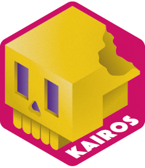
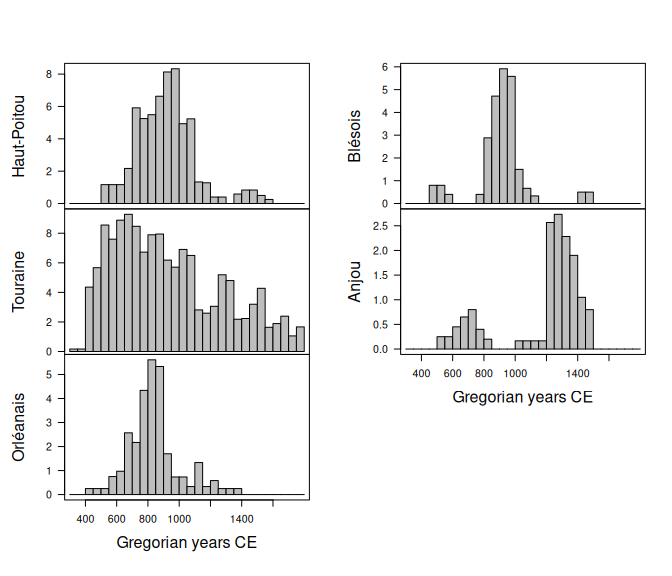

<!-- README.md is generated from README.Rmd. Please edit that file -->

# kairos 

<!-- badges: start -->

[](https://github.com/tesselle/kairos/actions)
[](https://app.codecov.io/gh/tesselle/kairos)
[](https://www.codefactor.io/repository/github/tesselle/kairos)
[](https://cran.r-project.org/package=kairos)

<a href="https://tesselle.r-universe.dev/kairos"
class="pkgdown-devel"></a>
<a href="https://cran.r-project.org/package=kairos"
class="pkgdown-release"></a> <a
href="https://cran.r-project.org/web/checks/check_results_kairos.html"
class="pkgdown-release"></a>
<a href="https://cran.r-project.org/package=kairos"
class="pkgdown-release"></a>

[](https://www.repostatus.org/#active)

[](https://doi.org/10.5281/zenodo.5653896)
<!-- badges: end -->

## Overview

A convenient and reproducible toolkit for relative and absolute dating
and analysis of chronological patterns. This package includes functions
for chronological modeling and dating of archaeological assemblages from
count data. It provides methods for matrix seriation. It also allows to
compute time point estimates and density estimates of the occupation and
duration of an archaeological site. **kairos** provides methods for:

- Matrix seriation: `seriate_rank()` and `seriate_average()`
- Mean ceramic date estimation (South 1977): `mcd()`
- Event and accumulation date estimation (Bellanger and Husi 2012):
  `event()`
- Aoristic analysis (Ratcliffe 2000): `aoristic()`
- Chronological apportioning (Roberts et al. 2012): `apportion()`

[**tabula**](https://packages.tesselle.org/tabula/) is a companion
package to **kairos** that provides functions for visualization and
analysis of archaeological count data.

    To cite kairos in publications use:

      Frerebeau N (2023). _kairos: Analysis of Chronological Patterns from
      Archaeological Count Data_. Université Bordeaux Montaigne, Pessac,
      France. doi:10.5281/zenodo.5653896
      <https://doi.org/10.5281/zenodo.5653896>, R package version 2.0.2,
      <https://packages.tesselle.org/kairos/>.

    A BibTeX entry for LaTeX users is

      @Manual{,
        author = {Nicolas Frerebeau},
        title = {{kairos: Analysis of Chronological Patterns from Archaeological Count Data}},
        year = {2023},
        organization = {Université Bordeaux Montaigne},
        address = {Pessac, France},
        note = {R package version 2.0.2},
        url = {https://packages.tesselle.org/kairos/},
        doi = {10.5281/zenodo.5653896},
      }

    This package is a part of the tesselle project
    <https://www.tesselle.org>.

## Installation

You can install the released version of **kairos** from
[CRAN](https://CRAN.R-project.org) with:

``` r
install.packages("kairos")
```

And the development version from [GitHub](https://github.com/) with:

``` r
# install.packages("remotes")
remotes::install_github("tesselle/kairos")
```

## Usage

``` r
## Load packages
library(kairos)
```

**kairos** v2.0 uses **aion** for internal date representation. Look at
`vignette("aion")` before you start.

*It assumes that you keep your data tidy*: each variable (type/taxa)
must be saved in its own column and each observation (sample/case) must
be saved in its own row.

``` r
## Data from Husi 2022
data("loire", package = "folio")
keep <- c("Anjou", "Blésois", "Orléanais", "Haut-Poitou", "Touraine")
loire <- subset(loire, area %in% keep)

## Get time range
loire_range <- loire[, c("lower", "upper")]

## Calculate aoristic sum (weights) by group
ao <- aoristic(loire_range, step = 50, weight = TRUE, groups = loire$area)

## Plot
plot(ao, col = "grey")
```

<!-- -->

``` r

## Rate of change by group
ro <- roc(ao, n = 30)
plot(ro)
```

<!-- -->

## Contributing

Please note that the **kairos** project is released with a [Contributor
Code of Conduct](https://www.tesselle.org/conduct.html). By contributing
to this project, you agree to abide by its terms.

## References

<div id="refs" class="references csl-bib-body hanging-indent">

<div id="ref-bellanger2012" class="csl-entry">

Bellanger, Lise, and Philippe Husi. 2012. “Statistical Tool for Dating
and Interpreting Archaeological Contexts Using Pottery.” *Journal of
Archaeological Science* 39 (4): 777–90.
<https://doi.org/10.1016/j.jas.2011.06.031>.

</div>

<div id="ref-ratcliffe2000" class="csl-entry">

Ratcliffe, Jerry H. 2000. “Aoristic Analysis: The Spatial Interpretation
of Unspecific Temporal Events.” *International Journal of Geographical
Information Science* 14 (7): 669–79.
<https://doi.org/10.1080/136588100424963>.

</div>

<div id="ref-roberts2012" class="csl-entry">

Roberts, John M., Barbara J. Mills, Jeffery J. Clark, W. Randall Haas,
Deborah L. Huntley, and Meaghan A. Trowbridge. 2012. “A Method for
Chronological Apportioning of Ceramic Assemblages.” *Journal of
Archaeological Science* 39 (5): 1513–20.
<https://doi.org/10.1016/j.jas.2011.12.022>.

</div>

<div id="ref-south1977" class="csl-entry">

South, S. A. 1977. *Method and Theory in Historical Archaeology*.
Studies in Archeology. New York: Academic Press.

</div>

</div>
