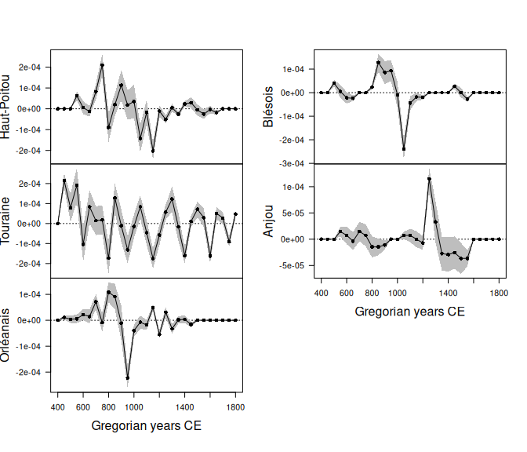

<!-- README.md is generated from README.Rmd. Please edit that file -->

# kairos 

<!-- badges: start -->

[](https://github.com/tesselle/kairos/actions)
[](https://codecov.io/gh/tesselle/kairos)

[](https://www.repostatus.org/#wip)
<!-- badges: end -->

## Overview

A toolkit for absolute dating and analysis of chronological patterns.
This package includes functions for chronological modeling and dating of
archaeological assemblages from count data. It allows to compute time
point estimates (e.g. Mean Ceramic Date) and density estimates of the
occupation and duration of an archaeological site.

**Initial development is in progress.**

## Installation

You can install the released version of **kairos** from
[CRAN](https://CRAN.R-project.org) with:

``` r
install.packages("kairos")
```

And the development version from [GitHub](https://github.com/) with:

``` r
# install.packages("remotes")
remotes::install_github("tesselle/kairos")
```

## Usage

``` r
## Load packages
library(kairos)
library(folio) # Datasets
```

**kairos** uses a set of S4 classes that represent different special
types of matrix. Please refer to the documentation of the
[**arkhe**](https://github.com/tesselle/arkhe) package where these
classes are defined.

*It assumes that you keep your data tidy*: each variable (type/taxa)
must be saved in its own column and each observation (sample/case) must
be saved in its own row.




## Contributing

Please note that the **kairos** project is released with a [Contributor
Code of Conduct](https://www.tesselle.org/conduct.html). By contributing
to this project, you agree to abide by its terms.
